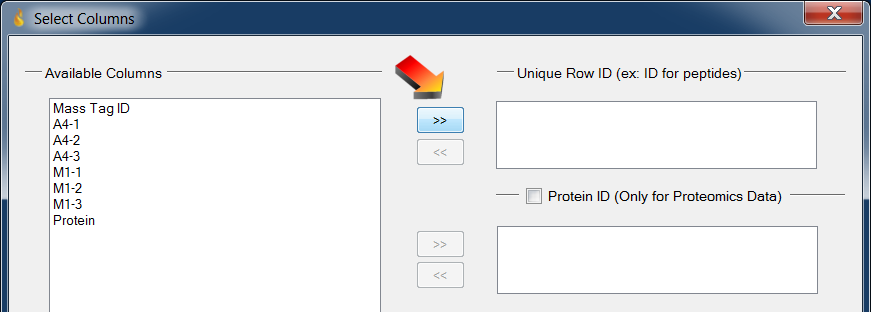
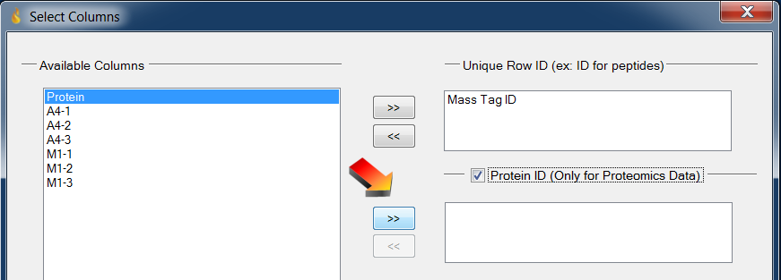
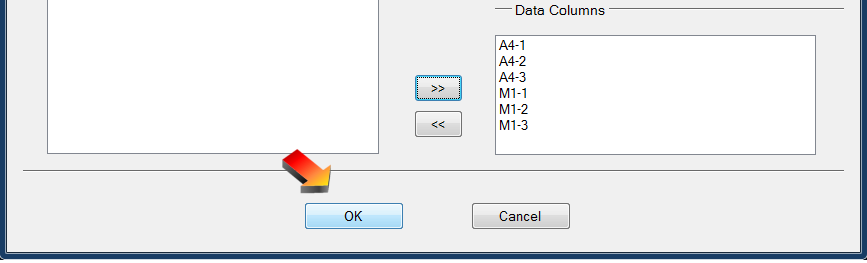
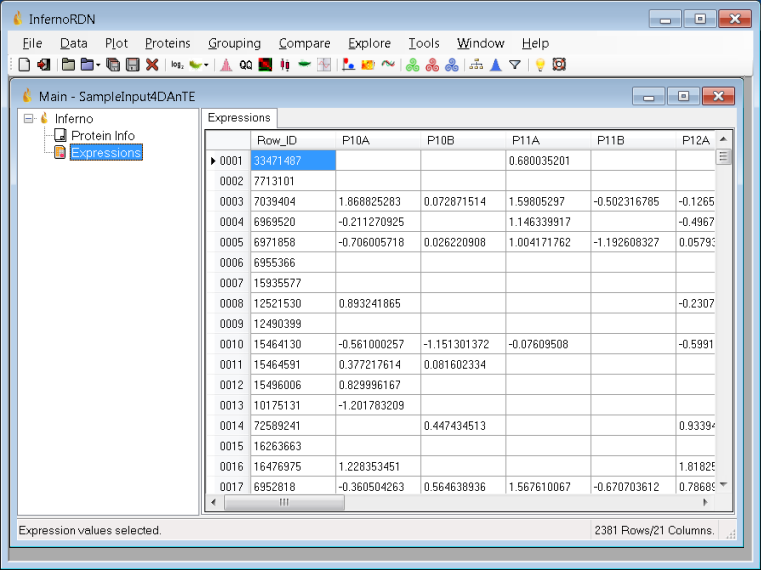
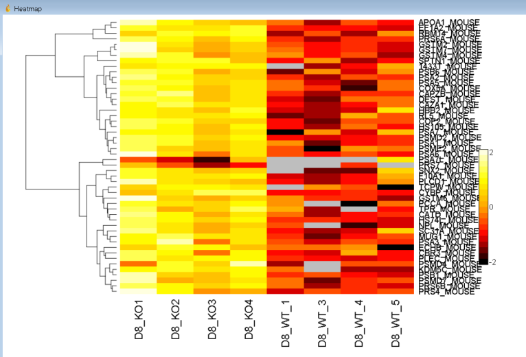
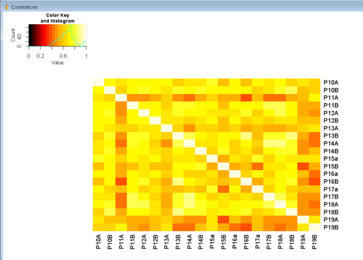
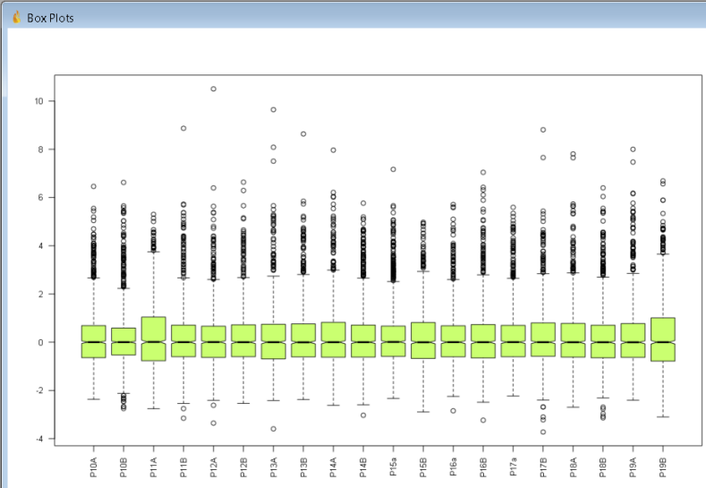
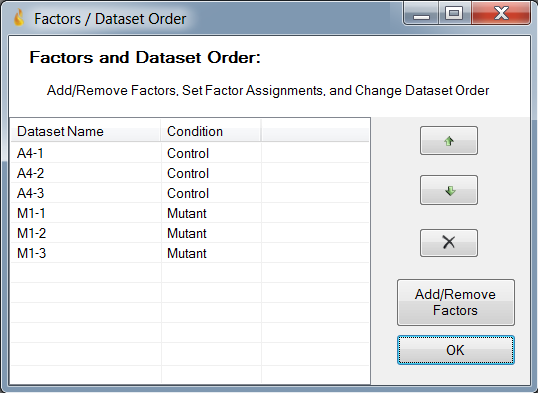

# __InfernoRDN__
InfernoRDN can perform various downstream data analysis, data reduction, and data comparison tasks including normalization, hypothesis testing, clustering, and heatmap generation.

### Description
InfernoRDN is a Windows application that provides an easy-to-use, graphical front-end to R for common data analysis tasks in "omics", with an emphasis on proteomics.  Some of the features included with InfernoRDN:

* A set of diagnostic plots (Histograms, boxplots, correlation plots, qq-plots, peptide-protein rollup plots, MA plots, PCA plots, etc).
* Log transforming.
* Rolling up to proteins (3 methods are available).
* LOESS normalization
* Linear Regression Normalization
* Mean Centering
* Median Absolute Deviation (MAD) Adjustment across datasets
* Quantile Normalization
* Principal Component Analysis
* Partial Least Squares Analysis
* ANOVA (multi-way, unbalanced, random effects)
* Heatmaps with Hierarchical and K-means cluster options

InfernoRDN uses R.NET (https://github.com/rdotnet/rdotnet) to communicate with R.  InfernoRDN is an updated version of Inferno (which used StatconnDCOM).  InfernoRDN supersedes all previous DAnTE (Data Analysis Tool Extension), DanteR, and Inferno versions.

See the Instructional Downloads section below for PDF documents that describe the program features in more detail.  Additional documentation and sample data files are included with the installer.

### Related Publications
[DAnTE: a statistical tool for quantitative analysis of -omics data.](https://pubmed.ncbi.nlm.nih.gov/18453552/)

### Downloads
* [Latest version](https://github.com/PNNL-Comp-Mass-Spec/InfernoRDN/releases/latest)
* [Source code on GitHub](https://github.com/PNNL-Comp-Mass-Spec/InfernoRDN)
* [InfernoRDN Overview](InfernoRDN_Overview.pdf)
* [InfernoRDN Step-by-step Instructions](InfernoRDN_Step_by_step_Instructions.pdf)

#### Software Instructions
Installation

1. Download and install R 3.5: https://cran.r-project.org/bin/windows/base
2. Download the InfernoRDN installer from https://github.com/PNNL-Comp-Mass-Spec/InfernoRDN/releases
3. Extract files from the zip file, then run the installer, InfernoRDNSetup.exe
4. Start InfernoRDN using the Start Menu or desktop shortcut
5. The InfernoRDN splash screen will appear and status messages will be shown
  * If a Dialog box appears asking "Would you like to use a personal library" you should answer Yes to that question, and Yes to the next question regarding the folder to use for the personal library
  * Following this, several Bioconductor packages will be downloaded

6. Test loading a data file
  * Choose File, Open, Expression File
  * Navigate to "C:\Program Files (x86)\InfernoRDN" (or C:\Program Files\InfernoRDN)
  * Select SampleInput4DAnTE.csv and click Open
  * Choose column Mass_Tag_ID then click the ">>" button to the left (and just below) "Unique Row ID"
  * Enable checkbox "Protein ID"
  * Select column MinOfOrf then click the ">>" button to the left (and just below) "Protein ID"
  * Select data columns P10A through P19B then click the ">>" button to the left (and below) "Data Columns"
  * Click OK

7. Test the plotting
  * Choose Plot, Correlation
  * Enable checkbox Toggle All, then click OK

Loading Data

  
Loading data: Select the column with unique Row IDs

  
Loading data: Select the Protein column

  
User Interface

  
InfernoRDN Main Window

  
Heatmap

  
Correlations

  
Box Plots

  
Defining Factors

### Acknowledgment

All publications that utilize this software should provide appropriate acknowledgement to PNNL and the InfernoRDN GitHub repository. However, if the software is extended or modified, then any subsequent publications should include a more extensive statement, as shown in the Readme file for the given application or on the website that more fully describes the application.

### Disclaimer

These programs are primarily designed to run on Windows machines. Please use them at your own risk. This material was prepared as an account of work sponsored by an agency of the United States Government. Neither the United States Government nor the United States Department of Energy, nor Battelle, nor any of their employees, makes any warranty, express or implied, or assumes any legal liability or responsibility for the accuracy, completeness, or usefulness or any information, apparatus, product, or process disclosed, or represents that its use would not infringe privately owned rights.

Portions of this research were supported by the NIH National Center for Research Resources (Grant RR018522), the W.R. Wiley Environmental Molecular Science Laboratory (a national scientific user facility sponsored by the U.S. Department of Energy's Office of Biological and Environmental Research and located at PNNL), and the National Institute of Allergy and Infectious Diseases (NIH/DHHS through interagency agreement Y1-AI-4894-01). PNNL is operated by Battelle Memorial Institute for the U.S. Department of Energy under contract DE-AC05-76RL0 1830.

We would like your feedback about the usefulness of the tools and information provided by the Resource. Your suggestions on how to increase their value to you will be appreciated. Please e-mail any comments to proteomics@pnl.gov
